# Dokumentasi Flowchart Proyek Klinik Merpati

Dokumen ini berisi kumpulan flowchart yang menjelaskan alur kerja sistem pakar diagnosa penyakit merpati pada proyek Klinik Merpati.

## 1. Alur Proses Konsultasi & Diagnosa (User)
Menjelaskan bagaimana pengguna melakukan konsultasi dari awal hingga mendapatkan hasil.

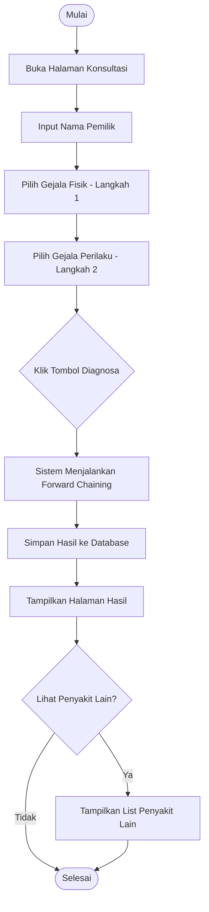

## 2. Logika Inferensi Forward Chaining
Detail teknis bagaimana fungsi `get_diagnosa()` mencocokkan gejala dengan aturan.

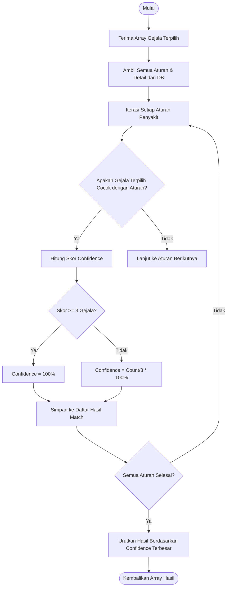

## 3. Alur Katalog Penyakit & Gejala
Menjelaskan navigasi pengguna di halaman katalog informasi.

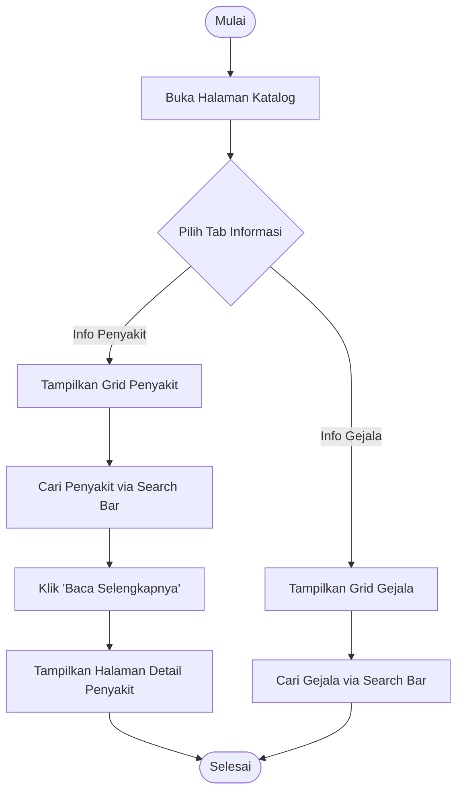

## 4. Alur Riwayat Diagnosa (User)
Menjelaskan bagaimana pengguna mencari dan memfilter data riwayat.

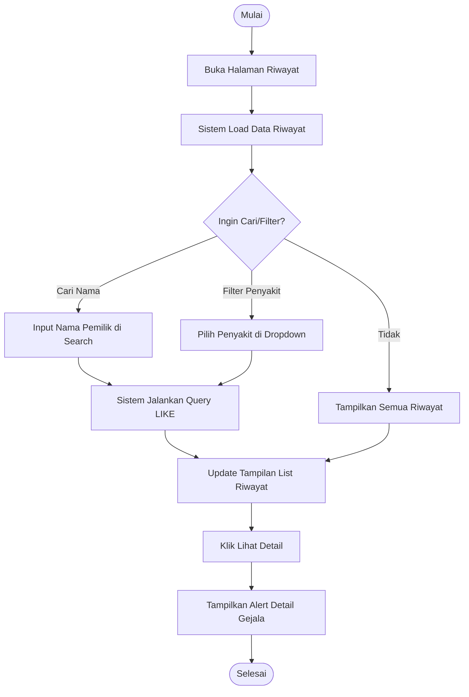

## 5. Alur Autentikasi Admin
Proses login untuk masuk ke dashboard admin.

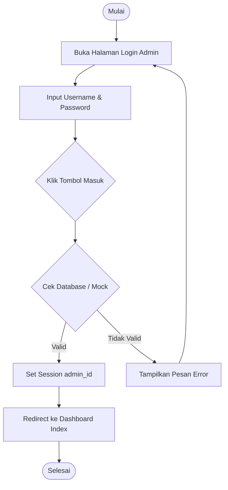

## 6. Pengelolaan Data Gejala (Admin)
Alur CRUD untuk data gejala klinis.

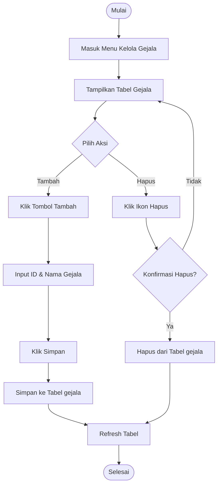

## 7. Pengelolaan Data Penyakit (Admin)
Alur CRUD untuk data penyakit merpati.

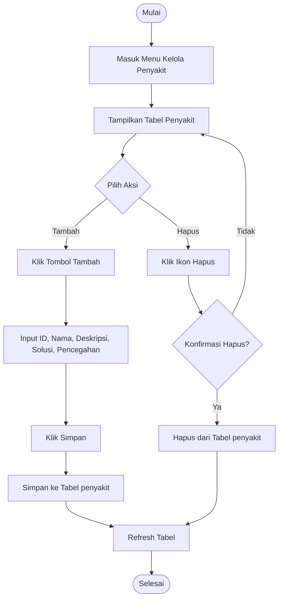

## 8. Pengelolaan Aturan / Rule (Admin)
Menjelaskan cara membuat aturan utama penyakit.

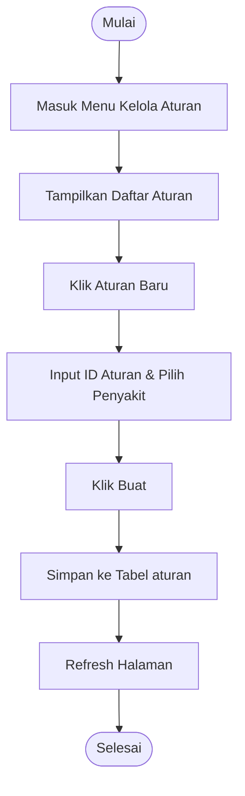

## 9. Pengelolaan Detail Gejala pada Aturan (Admin)
Menjelaskan bagaimana admin memetakan gejala ke dalam suatu aturan penyakit.

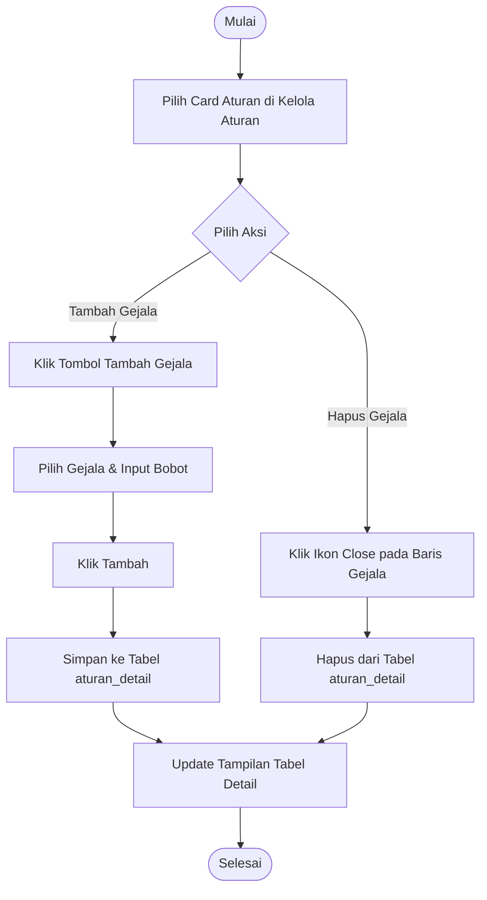

## 10. Navigasi Dashboard Admin
Struktur navigasi internal di dalam panel admin.

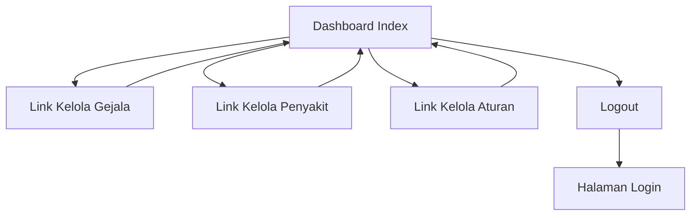

## 11. Navigasi Menu Utama Website (Frontend)
Struktur navigasi antar halaman untuk pengguna umum.

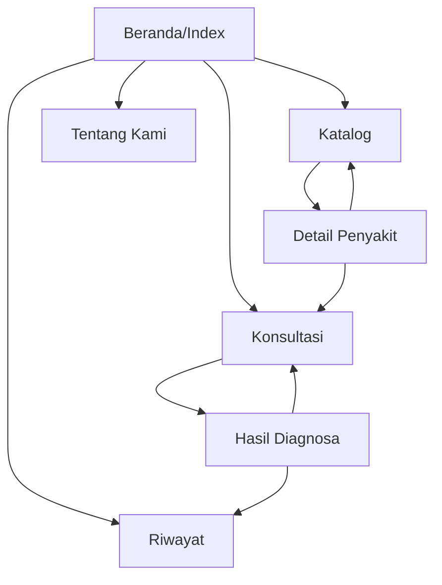

## 12. Alur Persistensi Data Diagnosa
Bagaimana data dari form dikirim dan disimpan ke database.

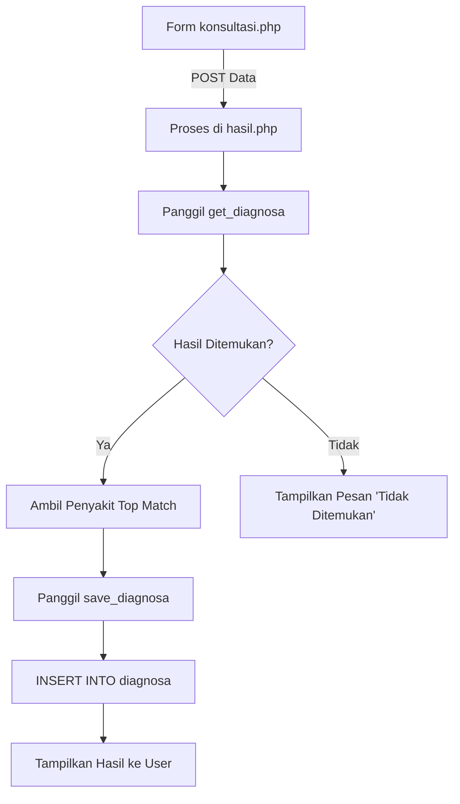
